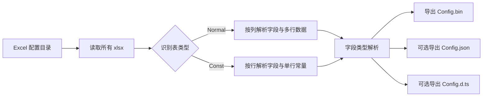

# ConfigExport（`@toolkit/config-export`）

ToolKit 工作区中的 Excel 配置导出工具，Node.js + TypeScript 实现。用于将 Excel 配置表导出为二进制文件，并可选导出 JSON 与 TypeScript 声明文件，适用于游戏配置、客户端配置同步、工具链自动化等场景。

本工具依赖工作区共享包 `@toolkit/shared`（协议类型、二进制常量、日志、参数解析、通用缓存与文件工具）。初次使用请先阅读工作区根目录的 [README](../../README.md)。

## 一、核心能力

- 递归扫描输入目录下所有 `.xlsx` 文件（自动忽略 Excel 临时文件）
- 支持两种表格模式：`Normal`（多行数据）和 `Const`（常量配置）
- 支持基础类型与数组类型（含多维数组）
- 支持 `pair` 与 `pair[]`，用于 number-number 键值对结构
- 导出二进制 `Config.bin`
- 可选导出 `Config.json`
- 可选导出 TypeScript 声明 `Config.d.ts`
- 可选导出配置表文字集 `Config.txt`（收集配表中全部文案，可直接喂给字体精简工具）
- 支持基于文件哈希的增量导出

## 二、项目结构

项目按职责拆分为清晰的分层模块：

```text
tools/config-export/
├── src/
│   ├── cli/                 # 本工具的命令行参数声明（解析器来自共享包）
│   ├── core/                # 打包主流程
│   ├── readers/             # Excel 读取
│   ├── parsers/             # 表结构与字段类型解析
│   ├── writers/             # Binary / JSON / TypeScript / Text 输出
│   ├── browser/             # 可独立分发的浏览器端解析器
│   └── index.ts             # 程序入口
├── package.json
├── tsconfig.json
└── README.md
```

公共能力全部来自 `@toolkit/shared`，本工具只保留业务实现：

| 能力 | 共享包位置 |
|---|---|
| 表/字段类型与协议模型 | `packages/shared/src/types/protocol.ts` |
| 二进制常量与缓冲写入器 | `packages/shared/src/binary/` |
| MD5 与文件扫描 | `packages/shared/src/utils/` |
| 带模块前缀的日志器 | `packages/shared/src/logger/` |
| 命令行解析与帮助文本 | `packages/shared/src/cli/` |
| 通用增量缓存 | `packages/shared/src/cache/` |

这种结构便于后续扩展：

- 增加新字段类型：先改共享包 `types/protocol.ts`，再改本工具 `parsers/field-type-parser.ts` 与 `writers` 层
- 增加新输出格式：在本工具 `writers` 新增实现，再接入 `core/packer.ts`
- 增加新输入源：在本工具 `readers` 新增读取器
- 增加新工具：见工作区根目录 README

## 三、环境与安装

建议环境：

- Node.js 18+
- pnpm 10+

本工具是 pnpm 工作区成员，请**在工作区根目录**安装依赖（一次安装即可覆盖所有工具与共享包）：

```bash
pnpm install
```

## 四、构建与运行

编译 TypeScript（`@toolkit/shared` 会按依赖拓扑先行构建）：

```bash
# 方式一：在根目录构建全部工具
pnpm build

# 方式二：只构建本工具
pnpm --filter @toolkit/config-export build
```

运行（开发/本地验证）：

```bash
# 在根目录
pnpm config-export [options] [inputDir]

# 或进入 tools/config-export 目录
pnpm start -- [options] [inputDir]
```

## 五、命令行参数

- `-i, --input <dir>` 输入目录（配置表目录）
- `-o, --output <dir>` 输出目录（默认：`输入目录/.generated`）
- `--no-incremental` 关闭增量导出
- `--json` 同时导出 JSON 文件
- `--text` 同时导出文字集 `Config.txt`（收集配表中所有字符串取值的文案，去重）
- `--no-ts` 不导出 TypeScript 声明
- `-f, --force` 强制全量导出
- `-h, --help` 显示帮助

示例：

```bash
# 使用默认输出目录
pnpm config-export ./ConfigTables

# 指定输入与输出
pnpm config-export -i ./ConfigTables -o ./Output

# 强制全量 + JSON
pnpm config-export ./ConfigTables -f --json

# 导出文字集，再交给字体精简工具裁剪字体（两个工具串联）
pnpm config-export ./ConfigTables --text
pnpm font-subset ./Fonts -t ./Output/Config.txt --formats ttf,woff2
```

## 六、表格格式规范

### 1) Normal 表

用于常规多行配置（例如道具表、角色表）。

- 第 1 行：表头，含表名与表类型（`Normal`）
- 第 2 行：字段描述
- 第 3 行：字段名
- 第 4 行：字段类型
- 第 5 行起：数据行

### 2) Const 表

用于常量配置（例如全局参数、开关配置）。

- 第 1 行：表头，含表名与表类型（`Const`）
- 第 2 行起：每行一条字段定义，包含描述、字段名、字段类型、字段值

## 六点五、可视化配表指南（给策划/配置同学）

这一节用于直接指导配表，建议首次接触本工具的同学先看这里。

### 1) 一图看懂导出流程



### 2) Normal 表可视化模板

用途：角色、道具、关卡等“多条记录”配置。

| 行号 | A列 | B列 | C列 | D列 | E列 | F列 |
|---|---|---|---|---|---|---|
| 1 | - | PlayerConfig | - | Normal | - | - |
| 2 | - | 主键ID | 玩家名 | 是否启用 | 奖励键值对 | 掉落键值对列表 |
| 3 | - | id | name | enabled | rewardPair | drops |
| 4 | - | int | string | bool | pair | pair[] |
| 5 | - | 1001 | 张三 | true | <1,200> | [<1,200>,<2,300>] |
| 6 | - | 1002 | 李四 | false | <2,500> | [<3,1000>] |

填写规则：

- 表名在 B1，表类型在 D1，必须是 `Normal`
- 字段从 B 列开始，B2/B3/B4 分别是描述/字段名/字段类型
- 第 5 行开始是数据行
- 数据行如果该表所有字段都为空，会被自动跳过

### 3) Const 表可视化模板

用途：全局参数、开关、阈值等“单组常量”配置。

| 行号 | A列 | B列 | C列 | D列 |
|---|---|---|---|---|
| 1 | - | GameConstConfig | - | Const |
| 2 | 最大体力 | maxEnergy | int | 100 |
| 3 | 是否开启活动 | eventEnabled | bool | true |
| 4 | 默认奖励 | defaultReward | pair | <1,500> |
| 5 | 活动奖励组 | eventRewards | pair[] | [<1,100>,<2,200>,<3,300>] |

填写规则：

- 表名在 B1，表类型在 D1，必须是 `Const`
- 从第 2 行开始，每一行定义一个字段
- A/B/C/D 分别为 描述/字段名/字段类型/字段值

### 4) 字段类型速查（含示例）

| 类型 | 示例值 | 说明 |
|---|---|---|
| int | 100 | 32位整数 |
| long | 1000000000 | 64位整数（JS 侧按 number 处理） |
| float | 1.5 | 单精度浮点数 |
| double | 3.14159 | 双精度浮点数 |
| string | "hello" | 字符串 |
| bool | true | 布尔值（true/false） |
| pair | <1,2> | 键值对（key=1, value=2） |
| int[] | [1,2,3] | 一维数组 |
| int[][] | [[1,2],[3,4]] | 二维数组 |
| pair[] | [<1,2>,<4,100>] | 键值对数组 |

### 5) 常见错误与正确写法

| 错误写法 | 正确写法 | 原因 |
|---|---|---|
| pair 值写成 (1,2) | <1,2> | pair 必须用尖括号 |
| pair[] 写成 <1,2>,<3,4> | [<1,2>,<3,4>] | 数组必须有方括号 |
| bool 写成 TRUE/FALSE/1/0 | true/false | 建议统一小写布尔字面量 |
| Normal 字段从 A 列开始 | 从 B 列开始 | A 列保留，不参与 Normal 字段定义 |
| D1 写 normal_table | D1 写 Normal | 表类型只识别 Normal/Const |

### 6) 配表前自检清单

- 表类型是否正确写在 D1（`Normal` 或 `Const`）
- 字段名是否唯一，且不留空
- 字段类型是否在支持列表内
- `pair` 是否严格使用 `<key,value>`
- 数组是否严格使用 `[...]`
- 多维数组括号是否成对

## 七、字段类型说明

### 基础类型

- `int`
- `long`
- `float`
- `double`
- `string`
- `bool`
- `pair`

### 数组类型

基础类型可叠加数组维度：

- `int[]`
- `string[]`
- `int[][]`
- `pair[]`
- `pair[][]`

### pair 格式

`pair` 表示 number-number 键值对：

- 类型：`pair`，值：`<1,2>`
- 类型：`pair[]`，值：`[<1,2>,<4,100>,<3,1000>]`

说明：`<1,2>` 中 `1` 为键，`2` 为值。

## 八、输出文件说明

默认输出目录下会生成：

- `Config.bin` 二进制主文件
- `Config.cache` 增量缓存文件
- `Config.json`（启用 `--json` 时）
- `Config.d.ts`（默认启用，可用 `--no-ts` 关闭）
- `Config.txt`（启用 `--text` 时）

文字集（`--text`）的收集规则：

- 只收集 `string` 基础类型的取值，包含 `string[]` 等多维数组的全部元素
- 数值、布尔与 `pair` 类型的取值不含文字，不会被收集
- 表名、字段名与描述属于开发期元信息，不会出现在游戏里，因此不参与收集——否则会把大量永不显示的字符带进字体子集，白白撑大包体
- 相同文案跨表去重，输出顺序为「表 → 行 → 字段」，每条文案一行，末尾保留换行
- 增量导出时同样成立：表格数据取自缓存，文字集仍按全量重新生成

## 八点五、浏览器环境解析 Config.bin

项目已提供浏览器可用解析器：

- [tools/config-export/src/browser/config-reader-web.ts](src/browser/config-reader-web.ts)

它只依赖 Web 标准对象（`ArrayBuffer`、`DataView`、`TextDecoder`），不依赖 Node.js 的 `fs/path`。

该文件刻意保持**零导入、自包含**，便于直接复制到游戏客户端工程中使用。因此其中的 `TableType` / `FieldType` 枚举与 `MAGIC` / `VERSION` 常量在此重复定义，修改协议时务必与 `@toolkit/shared` 保持同步：

- `packages/shared/src/types/protocol.ts`
- `packages/shared/src/binary/constants.ts`

### 浏览器示例

```ts
import { parseConfigBinary } from "./config-reader-web";

async function loadConfig(url: string) {
	const resp = await fetch(url);
	if (!resp.ok) {
		throw new Error(`HTTP ${resp.status}`);
	}

	const buffer = await resp.arrayBuffer();
	const data = parseConfigBinary(buffer);

	console.log("tables:", data.tables.length);
	console.log("first table:", data.tables[0]?.name);
}

loadConfig("/assets/Config.bin");
```

### 返回数据结构说明

- `data.tables`：所有表
- `table.fields`：字段定义（字段名 + 类型信息）
- `table.rows`：行数据数组
- `pair` 字段将解析为 `{ key: number, value: number }`

## 九、二进制协议简述

协议与原工具保持一致：

- 文件头：`MAGIC(4)` + `VERSION(4)` + `TableCount(4)`
- 每张表：`TableName` + `TableType(1)` + `FieldCount(4)`
- 每字段：`FieldName` + `BaseType(1)` + `Dimension(1)`
- 数据：`RowCount(4)` + 按字段顺序写值
- 值编码：先写 `isNotNull(1)`，再写实际值

`pair` 的编码方式：连续写入两个 `double`，顺序为 `key`、`value`。

## 十、增量导出机制

增量模式下，会对输入文件计算 MD5 并记录到 `Config.cache`。

- 文件内容未变化：复用缓存中的解析结果，不重复读取 Excel
- 文件内容变化：重新解析并更新缓存
- 每次运行都会基于当前目录中的所有文件重建完整输出，因此不会丢失未变化文件的表
- 已删除的输入文件会从缓存和输出中移除
- `--force`：清空缓存并重新解析所有文件

`Config.cache` 的结构为 `{ "<输入文件绝对路径>": { "hash": "<MD5>", "data": [<解析出的表>] } }`。
缓存只是本地可再生的加速产物，命中失败（例如手工改动过该文件）只会退化为一次全量重解析，不会报错。

## 十一、扩展指南

### 新增字段类型

建议按以下顺序改造：

1. 在 `packages/shared/src/types/protocol.ts` 扩展 `FieldType`
2. 在 `src/parsers/field-type-parser.ts` 增加字符串映射与值解析
3. 在 `src/writers/binary-writer.ts` 增加二进制写入逻辑
4. 在 `src/writers/typescript-writer.ts` 增加 TS 类型映射
5. 更新文档与示例配置

### 新增输出格式

1. 在 `src/writers` 新增输出器
2. 在 `src/core/packer.ts` 接入调用开关
3. 在 `src/cli/args.ts` 增加参数支持

## 十二、常见问题

1. 为什么没有生成任何表？

- 检查输入目录是否正确
- 检查 Excel 表头中表类型是否为 `Normal` 或 `Const`

2. pair 数组解析失败怎么办？

- 检查格式是否严格为 `[...]` 与 `<k,v>`
- 检查逗号与括号是否成对

3. 需要强制全量导出怎么办？

- 使用 `-f` 或 `--force`

---

如需和旧版 C# 工具做结果一致性回归，建议使用同一份 Excel 输入，比较 `Config.bin`、`Config.json` 和 `Config.d.ts` 的输出差异。
